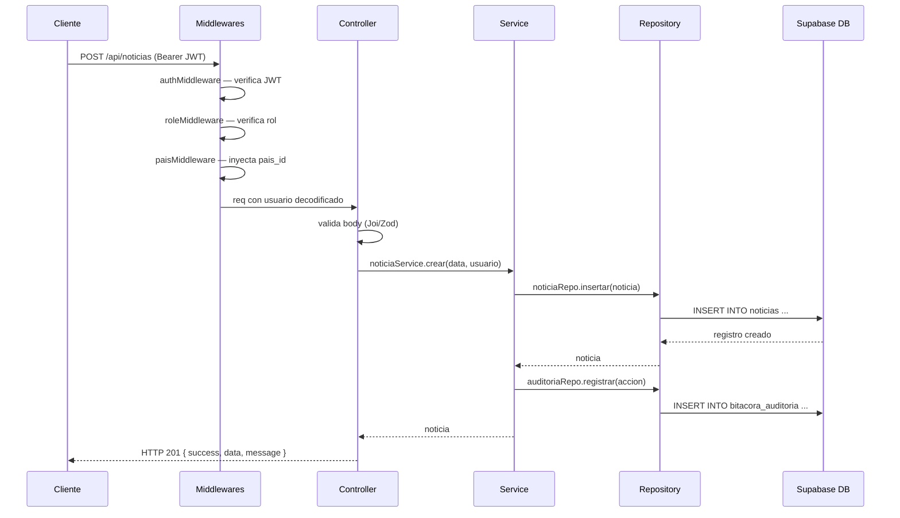
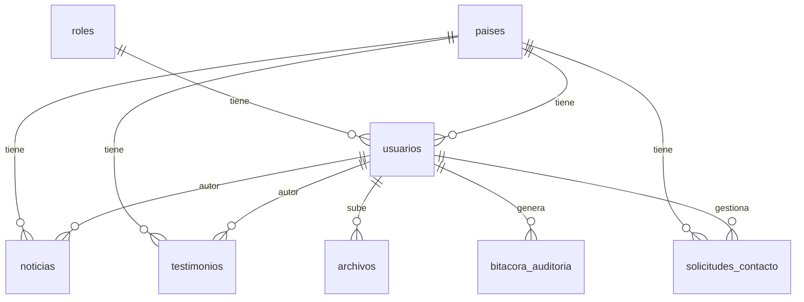

# Design Document — CMS Multiportal Backend

## Overview

El CMS Multiportal Backend es una API REST construida con **Node.js + Express + TypeScript** que centraliza la administración de contenido (noticias, testimonios y solicitudes de contacto) para los portales de Colombia, Chile y Ecuador. Una única instancia del servicio atiende a múltiples portales mediante aislamiento de datos por `pais_id`.

### Objetivos de diseño

- **Multitenancy por país**: cada recurso pertenece a un país; los usuarios con rol `admin_pais` o `editor` solo ven y operan sobre su propio país.
- **Control de acceso basado en roles (RBAC)**: tres roles (`superadmin`, `admin_pais`, `editor`) con permisos diferenciados aplicados en middleware.
- **Auditoría completa**: toda operación de escritura queda registrada en `bitacora_auditoria`.
- **Endpoints públicos sin autenticación**: los visitantes pueden consultar contenido publicado y enviar solicitudes de contacto.
- **Respuesta JSON consistente**: estructura uniforme `{ success, data, message, errors }` en todas las respuestas.

### Alcance

| Módulo | Descripción |
|---|---|
| Auth | Login / logout con JWT |
| Países | CRUD de portales |
| Usuarios | CRUD de usuarios administrativos |
| Noticias | CRUD + publicación + listado |
| Testimonios | CRUD + publicación + destacado + listado |
| Solicitudes | Recepción pública + administración |
| Archivos | Subida y registro de imágenes |
| Auditoría | Bitácora de operaciones |

---

## Architecture

### Diagrama de capas

```
┌─────────────────────────────────────────────────────────┐
│                     Clientes HTTP                        │
│          (Portales web, panel administrativo)            │
└────────────────────────┬────────────────────────────────┘
                         │ HTTP/REST
┌────────────────────────▼────────────────────────────────┐
│                   Express App                            │
│  ┌──────────────────────────────────────────────────┐   │
│  │                  Middlewares                      │   │
│  │  cors · helmet · express.json · rateLimiter       │   │
│  │  authMiddleware · roleMiddleware · paisMiddleware  │   │
│  └──────────────────────────────────────────────────┘   │
│  ┌──────────────────────────────────────────────────┐   │
│  │                   Routes                         │   │
│  │  /api/auth  /api/paises  /api/usuarios            │   │
│  │  /api/noticias  /api/testimonios                  │   │
│  │  /api/solicitudes  /api/archivos  /api/auditoria  │   │
│  │  /public/:paisSlug/noticias  /public/:paisSlug/   │   │
│  │  testimonios                                      │   │
│  └──────────────────────────────────────────────────┘   │
│  ┌──────────────────────────────────────────────────┐   │
│  │                 Controllers                       │   │
│  │  Validan input · delegan a Services · formatean   │   │
│  │  respuesta JSON                                   │   │
│  └──────────────────────────────────────────────────┘   │
│  ┌──────────────────────────────────────────────────┐   │
│  │                  Services                        │   │
│  │  Lógica de negocio · reglas de rol · auditoría   │   │
│  └──────────────────────────────────────────────────┘   │
│  ┌──────────────────────────────────────────────────┐   │
│  │                Repositories                      │   │
│  │  Acceso a datos · consultas Supabase/PostgreSQL   │   │
│  └──────────────────────────────────────────────────┘   │
└────────────────────────┬────────────────────────────────┘
                         │ Supabase JS Client / pg
┌────────────────────────▼────────────────────────────────┐
│              Supabase (PostgreSQL)                       │
│  paises · usuarios · noticias · testimonios              │
│  solicitudes_contacto · archivos · bitacora_auditoria    │
└─────────────────────────────────────────────────────────┘
```

### Flujo de una petición autenticada



### Estructura de carpetas

```
src/
├── config/
│   ├── supabase.ts          # Cliente Supabase inicializado
│   ├── jwt.ts               # Configuración de JWT (secret, expiración)
│   └── env.ts               # Validación y exportación de variables de entorno
├── controllers/
│   ├── auth.controller.ts
│   ├── pais.controller.ts
│   ├── usuario.controller.ts
│   ├── noticia.controller.ts
│   ├── testimonio.controller.ts
│   ├── solicitud.controller.ts
│   ├── archivo.controller.ts
│   └── auditoria.controller.ts
├── services/
│   ├── auth.service.ts
│   ├── pais.service.ts
│   ├── usuario.service.ts
│   ├── noticia.service.ts
│   ├── testimonio.service.ts
│   ├── solicitud.service.ts
│   ├── archivo.service.ts
│   └── auditoria.service.ts
├── repositories/
│   ├── pais.repository.ts
│   ├── usuario.repository.ts
│   ├── noticia.repository.ts
│   ├── testimonio.repository.ts
│   ├── solicitud.repository.ts
│   ├── archivo.repository.ts
│   └── auditoria.repository.ts
├── routes/
│   ├── auth.routes.ts
│   ├── pais.routes.ts
│   ├── usuario.routes.ts
│   ├── noticia.routes.ts
│   ├── testimonio.routes.ts
│   ├── solicitud.routes.ts
│   ├── archivo.routes.ts
│   ├── auditoria.routes.ts
│   └── public.routes.ts     # Endpoints sin autenticación
├── middlewares/
│   ├── auth.middleware.ts    # Verifica y decodifica JWT
│   ├── role.middleware.ts    # Verifica rol requerido
│   ├── pais.middleware.ts    # Aplica filtro de país al contexto
│   └── errorHandler.ts      # Manejador global de errores
├── types/
│   ├── express.d.ts         # Extensión de Request con req.usuario
│   ├── models.ts            # Interfaces de dominio (Pais, Usuario, Noticia, etc.)
│   └── dtos.ts              # DTOs de entrada/salida por módulo
├── app.ts                   # Configuración de Express
└── server.ts                # Punto de entrada, escucha HTTP
```

---

## Components and Interfaces

### Middlewares

#### `auth.middleware.ts`

```ts
// Extrae el Bearer token del header Authorization,
// verifica la firma y expiración con jwt.verify(),
// inyecta req.usuario = { usuario_id, rol, pais_id, username }
export const verifyToken = (req: Request, res: Response, next: NextFunction): void
```

#### `role.middleware.ts`

```ts
// Fábrica que recibe los roles permitidos y retorna un middleware
// que compara req.usuario.rol contra la lista.
export const requireRole = (...roles: RolNombre[]) => (req: Request, res: Response, next: NextFunction): void
```

#### `pais.middleware.ts`

```ts
// Para admin_pais y editor: fuerza req.paisFiltro = req.usuario.pais_id
// Para superadmin: permite req.paisFiltro = query.pais_id || null
export const applyPaisFilter = (req: Request, res: Response, next: NextFunction): void
```

#### `errorHandler.ts`

```ts
// Captura errores lanzados con next(err) o errores no controlados.
// Mapea AppError a su código HTTP y formatea la respuesta estándar.
export const errorHandler = (err: AppError | Error, req: Request, res: Response, next: NextFunction): void
```

### Types (`src/types/`)

#### `models.ts` — interfaces de dominio

```ts
export interface Pais {
  id: number;
  nombre: string;
  codigo: string;
  slug: string;
  estado: string;
  created_at: string;
  updated_at: string;
}

export interface Rol {
  id: number;
  nombre: RolNombre;
  descripcion: string | null;
  created_at: string;
}

export type RolNombre = 'superadmin' | 'admin_pais' | 'editor';

export interface Usuario {
  id: number;
  nombre: string;
  apellido: string;
  email: string;
  username: string;
  password_hash: string;
  rol_id: number;
  pais_id: number | null;
  estado: string;
  ultimo_acceso: string | null;
  created_at: string;
  updated_at: string;
}

export interface Noticia {
  id: number;
  pais_id: number;
  autor_id: number;
  titulo: string;
  slug: string;
  resumen: string;
  contenido: string;
  imagen_principal_url: string | null;
  estado: EstadoContenido;
  fecha_publicacion: string | null;
  created_at: string;
  updated_at: string;
}

export interface Testimonio {
  id: number;
  pais_id: number;
  autor_id: number;
  nombre: string;
  cargo: string | null;
  empresa: string | null;
  contenido: string;
  foto_url: string | null;
  instagram_url: string | null;
  facebook_url: string | null;
  estado: EstadoContenido;
  destacado: boolean;
  fecha_publicacion: string | null;
  created_at: string;
  updated_at: string;
}

export interface SolicitudContacto {
  id: number;
  pais_id: number;
  nombre: string;
  correo: string;
  telefono: string | null;
  finalidad: string | null;
  mensaje: string | null;
  estado: EstadoSolicitud;
  observaciones_admin: string | null;
  fecha_gestion: string | null;
  gestionado_por: number | null;
  created_at: string;
  updated_at: string;
}

export type EstadoContenido = 'borrador' | 'publicado' | 'despublicado' | 'eliminado';
export type EstadoSolicitud = 'pendiente' | 'en_proceso' | 'gestionada' | 'cerrada' | 'eliminado';
```

#### `express.d.ts` — extensión de Request

```ts
import { JwtPayload } from './dtos';

declare global {
  namespace Express {
    interface Request {
      usuario?: JwtPayload;
      paisFiltro?: number | null;
    }
  }
}
```

#### `dtos.ts` — DTOs de entrada/salida

```ts
export interface JwtPayload {
  usuario_id: number;
  rol: RolNombre;
  pais_id: number | null;
  username: string;
}

export interface ApiResponse<T = unknown> {
  success: boolean;
  data: T | null;
  message: string;
  errors: string[] | null;
}

export interface PaginatedResponse<T> {
  data: T[];
  total: number;
  page: number;
  limit: number;
}
```

### Controllers

Cada controller sigue el patrón:
1. Extrae y valida el body/params/query con un schema Zod.
2. Llama al service correspondiente.
3. Formatea y retorna la respuesta JSON estándar tipada con `ApiResponse<T>`.

```ts
// Ejemplo: noticia.controller.ts
export const crear = async (req: Request, res: Response, next: NextFunction): Promise<void>
export const listar = async (req: Request, res: Response, next: NextFunction): Promise<void>
export const obtener = async (req: Request, res: Response, next: NextFunction): Promise<void>
export const actualizar = async (req: Request, res: Response, next: NextFunction): Promise<void>
export const eliminar = async (req: Request, res: Response, next: NextFunction): Promise<void>
export const publicar = async (req: Request, res: Response, next: NextFunction): Promise<void>
export const despublicar = async (req: Request, res: Response, next: NextFunction): Promise<void>
```

### Services

Contienen la lógica de negocio. Reciben DTOs validados y el objeto `usuario` del contexto.

```ts
// auth.service.ts
login(username: string, password: string, ip: string): Promise<{ token: string; usuario: Omit<Usuario, 'password_hash'> }>
logout(usuario_id: number, ip: string): Promise<void>

// pais.service.ts
listar(): Promise<Pais[]>
crear(data: CrearPaisDto, usuario: JwtPayload): Promise<Pais>
actualizar(id: number, data: ActualizarPaisDto, usuario: JwtPayload): Promise<Pais>
eliminar(id: number, usuario: JwtPayload): Promise<void>

// usuario.service.ts
listar(filtros: FiltrosUsuarioDto): Promise<Usuario[]>
crear(data: CrearUsuarioDto, usuario: JwtPayload): Promise<Omit<Usuario, 'password_hash'>>
actualizar(id: number, data: ActualizarUsuarioDto, usuario: JwtPayload): Promise<Omit<Usuario, 'password_hash'>>
desactivar(id: number, usuario: JwtPayload): Promise<void>

// noticia.service.ts
listar(filtros: FiltrosNoticiaDto, usuario: JwtPayload): Promise<PaginatedResponse<Noticia>>
crear(data: CrearNoticiaDto, usuario: JwtPayload): Promise<Noticia>
actualizar(id: number, data: ActualizarNoticiaDto, usuario: JwtPayload): Promise<Noticia>
eliminar(id: number, usuario: JwtPayload): Promise<void>
publicar(id: number, usuario: JwtPayload): Promise<Noticia>
despublicar(id: number, usuario: JwtPayload): Promise<Noticia>
obtenerPublica(paisSlug: string, noticiaSlug: string): Promise<Noticia>

// testimonio.service.ts — misma firma que noticia.service.ts
// + marcarDestacado(id: number, destacado: boolean, usuario: JwtPayload): Promise<Testimonio>

// solicitud.service.ts
crearPublica(data: CrearSolicitudDto): Promise<SolicitudContacto>
listar(filtros: FiltrosSolicitudDto, usuario: JwtPayload): Promise<PaginatedResponse<SolicitudContacto>>
actualizarEstado(id: number, data: ActualizarSolicitudDto, usuario: JwtPayload): Promise<SolicitudContacto>
eliminar(id: number, usuario: JwtPayload): Promise<void>

// archivo.service.ts
subir(file: Express.Multer.File, meta: ArchivoMetaDto, usuario: JwtPayload): Promise<Archivo>

// auditoria.service.ts
listar(filtros: FiltrosAuditoriaDto): Promise<PaginatedResponse<BitacoraAuditoria>>
registrar(entrada: RegistrarAuditoriaDto): Promise<void>
```

### Repositories

Abstraen todas las consultas a Supabase. Reciben y retornan objetos de dominio tipados.

```ts
// Patrón genérico tipado
findAll(filtros: Record<string, unknown>): Promise<T[]>
findById(id: number): Promise<T | null>
insert(data: Partial<T>): Promise<T>
update(id: number, data: Partial<T>): Promise<T>
softDelete(id: number): Promise<void>
```

---

## Data Models

### Tabla `paises`

| Campo | Tipo | Restricciones |
|---|---|---|
| `id` | int8 | PK, autoincrement |
| `nombre` | TEXT | NOT NULL |
| `codigo` | TEXT | NOT NULL, UNIQUE |
| `slug` | TEXT | NOT NULL, UNIQUE |
| `estado` | TEXT | NOT NULL, default 'activo' |
| `created_at` | TIMESTAMPTZ | NOT NULL, default now() |
| `updated_at` | TIMESTAMPTZ | NOT NULL, default now() |

### Tabla `roles`

| Campo | Tipo | Restricciones |
|---|---|---|
| `id` | int8 | PK, autoincrement |
| `nombre` | TEXT | NOT NULL, UNIQUE — valores: superadmin, admin_pais, editor |
| `descripcion` | TEXT | nullable |
| `created_at` | TIMESTAMPTZ | NOT NULL, default now() |

### Tabla `usuarios`

| Campo | Tipo | Restricciones |
|---|---|---|
| `id` | int8 | PK, autoincrement |
| `nombre` | TEXT | NOT NULL |
| `apellido` | TEXT | NOT NULL |
| `email` | TEXT | NOT NULL, UNIQUE |
| `username` | TEXT | NOT NULL, UNIQUE |
| `password_hash` | TEXT | NOT NULL |
| `rol_id` | int8 | NOT NULL, FK → roles.id |
| `pais_id` | int8 | FK → paises.id, nullable (solo superadmin) |
| `estado` | TEXT | NOT NULL, default 'activo' |
| `ultimo_acceso` | TIMESTAMPTZ | nullable |
| `created_at` | TIMESTAMPTZ | NOT NULL, default now() |
| `updated_at` | TIMESTAMPTZ | NOT NULL, default now() |

**Regla de negocio**: `pais_id` es obligatorio cuando `roles.nombre IN ('admin_pais', 'editor')`.

### Tabla `noticias`

| Campo | Tipo | Restricciones |
|---|---|---|
| `id` | int8 | PK, autoincrement |
| `pais_id` | int8 | NOT NULL, FK → paises.id |
| `autor_id` | int8 | NOT NULL, FK → usuarios.id |
| `titulo` | TEXT | NOT NULL |
| `slug` | TEXT | NOT NULL, UNIQUE(slug, pais_id) |
| `resumen` | TEXT | NOT NULL |
| `contenido` | TEXT | NOT NULL |
| `imagen_principal_url` | TEXT | nullable |
| `estado` | TEXT | NOT NULL, default 'borrador' |
| `fecha_publicacion` | TIMESTAMPTZ | nullable |
| `created_at` | TIMESTAMPTZ | NOT NULL, default now() |
| `updated_at` | TIMESTAMPTZ | NOT NULL, default now() |

**Estados válidos**: `borrador`, `publicado`, `despublicado`, `eliminado`.

### Tabla `testimonios`

| Campo | Tipo | Restricciones |
|---|---|---|
| `id` | int8 | PK, autoincrement |
| `pais_id` | int8 | NOT NULL, FK → paises.id |
| `autor_id` | int8 | NOT NULL, FK → usuarios.id |
| `nombre` | TEXT | NOT NULL |
| `cargo` | TEXT | nullable |
| `empresa` | TEXT | nullable |
| `contenido` | TEXT | NOT NULL |
| `foto_url` | TEXT | nullable |
| `instagram_url` | TEXT | nullable |
| `facebook_url` | TEXT | nullable |
| `estado` | TEXT | NOT NULL, default 'borrador' |
| `destacado` | BOOLEAN | NOT NULL, default false |
| `fecha_publicacion` | TIMESTAMPTZ | nullable |
| `created_at` | TIMESTAMPTZ | NOT NULL, default now() |
| `updated_at` | TIMESTAMPTZ | NOT NULL, default now() |

**Estados válidos**: `borrador`, `publicado`, `despublicado`, `eliminado`.

### Tabla `solicitudes_contacto`

| Campo | Tipo | Restricciones |
|---|---|---|
| `id` | int8 | PK, autoincrement |
| `pais_id` | int8 | NOT NULL, FK → paises.id |
| `nombre` | TEXT | NOT NULL |
| `correo` | TEXT | NOT NULL |
| `telefono` | TEXT | nullable |
| `finalidad` | TEXT | nullable |
| `mensaje` | TEXT | nullable |
| `estado` | TEXT | NOT NULL, default 'pendiente' |
| `observaciones_admin` | TEXT | nullable |
| `fecha_gestion` | TIMESTAMPTZ | nullable |
| `gestionado_por` | int8 | FK → usuarios.id, nullable |
| `created_at` | TIMESTAMPTZ | NOT NULL, default now() |
| `updated_at` | TIMESTAMPTZ | NOT NULL, default now() |

**Estados válidos**: `pendiente`, `en_proceso`, `gestionada`, `cerrada`, `eliminado`.

### Tabla `archivos`

| Campo | Tipo | Restricciones |
|---|---|---|
| `id` | int8 | PK, autoincrement |
| `nombre_archivo` | TEXT | NOT NULL |
| `url` | TEXT | NOT NULL |
| `tipo_archivo` | TEXT | NOT NULL |
| `modulo` | TEXT | NOT NULL |
| `referencia_id` | int8 | nullable |
| `subido_por` | int8 | NOT NULL, FK → usuarios.id |
| `created_at` | TIMESTAMPTZ | NOT NULL, default now() |

### Tabla `bitacora_auditoria`

| Campo | Tipo | Restricciones |
|---|---|---|
| `id` | int8 | PK, autoincrement |
| `usuario_id` | int8 | FK → usuarios.id, nullable (para acciones de sistema) |
| `accion` | TEXT | NOT NULL — ej. LOGIN, LOGOUT, CREAR, EDITAR, ELIMINAR, PUBLICAR |
| `modulo` | TEXT | NOT NULL — ej. noticias, testimonios, usuarios |
| `registro_id` | int8 | nullable |
| `descripcion` | TEXT | nullable |
| `ip` | TEXT | nullable |
| `created_at` | TIMESTAMPTZ | NOT NULL, default now() |

### Diagrama entidad-relación (simplificado)



### Estructura del JWT payload

```json
{
  "usuario_id": 1,
  "rol": "admin_pais",
  "rol_nombre": "admin_pais",
  "pais_id": 2,
  "username": "string",
  "iat": 1700000000,
  "exp": 1700028800
}
```

### Formato de respuesta estándar

```json
{
  "success": true,
  "data": {},
  "message": "Operación exitosa",
  "errors": null
}
```

### Formato de respuesta de error

```json
{
  "success": false,
  "data": null,
  "message": "Descripción del error en español",
  "errors": ["campo: detalle del error"]
}
```

---

## Correctness Properties

*Una propiedad es una característica o comportamiento que debe mantenerse verdadero en todas las ejecuciones válidas del sistema — esencialmente, una declaración formal sobre lo que el sistema debe hacer. Las propiedades sirven como puente entre las especificaciones legibles por humanos y las garantías de corrección verificables por máquina.*

---

### Property 1: JWT emitido contiene payload completo y expira en 8 horas

*Para cualquier* usuario válido (con cualquier rol y pais_id) que realiza un login exitoso, el JWT emitido debe contener los campos `usuario_id`, `rol`, `pais_id` y `username` con los valores correctos, y la diferencia `exp - iat` debe ser exactamente 28800 segundos (8 horas).

**Validates: Requirements 1.1, 1.5**

---

### Property 2: Auditoría registra login y logout para cualquier usuario

*Para cualquier* usuario válido que realiza un login exitoso o un logout, la tabla `bitacora_auditoria` debe contener una entrada con el `usuario_id` correcto, la `accion` correspondiente (`LOGIN` o `LOGOUT`) y la `ip` del solicitante.

**Validates: Requirements 1.4, 2.1**

---

### Property 3: Endpoints protegidos rechazan solicitudes sin JWT válido

*Para cualquier* endpoint protegido del sistema, una solicitud enviada sin JWT, con JWT expirado o con firma inválida debe retornar HTTP 401 con la estructura de respuesta estándar.

**Validates: Requirements 3.1, 3.2**

---

### Property 4: Aislamiento de datos por país para admin_pais y editor

*Para cualquier* usuario con rol `admin_pais` o `editor`, todos los recursos retornados por cualquier endpoint de listado deben pertenecer exclusivamente al `pais_id` asignado al usuario. Ningún recurso de otro país debe aparecer en la respuesta.

**Validates: Requirements 3.3, 3.4, 8.2, 11.2, 13.2**

---

### Property 5: Superadmin accede a recursos de todos los países

*Para cualquier* recurso del sistema (noticia, testimonio, solicitud, usuario) perteneciente a cualquier país, un usuario con rol `superadmin` debe poder acceder a él sin restricción de `pais_id`.

**Validates: Requirements 3.5**

---

### Property 6: Unicidad de campos identificadores en países y usuarios

*Para cualquier* intento de crear un país con `codigo` o `slug` ya existente, o un usuario con `email` o `username` ya existente, el sistema debe retornar HTTP 409 identificando el campo en conflicto. No pueden existir dos registros con el mismo valor en esos campos.

**Validates: Requirements 4.1, 4.2, 5.1, 5.2**

---

### Property 7: Listado de países ordenado por nombre ascendente

*Para cualquier* conjunto de países en la base de datos, el listado retornado por `GET /api/paises` debe estar ordenado por el campo `nombre` de forma ascendente (A → Z).

**Validates: Requirements 4.3**

---

### Property 8: Cambios de estado persisten y generan entrada de auditoría

*Para cualquier* recurso del sistema (país, usuario, noticia, testimonio, solicitud) cuyo estado sea actualizado por un usuario autorizado, el nuevo estado debe persistir en la base de datos y debe existir una entrada en `bitacora_auditoria` con el `usuario_id`, `accion`, `modulo` y `registro_id` correctos.

**Validates: Requirements 4.5, 5.6, 6.4, 6.5, 7.1, 7.2, 9.2, 9.3, 10.1, 10.2, 13.3, 13.4, 13.5, 16.1**

---

### Property 9: Contraseñas almacenadas como hash bcrypt con cost ≥ 10

*Para cualquier* contraseña proporcionada al crear un usuario, el valor almacenado en `password_hash` debe ser un hash bcrypt válido con factor de costo mínimo de 10, y `bcrypt.compare(password, hash)` debe retornar `true`.

**Validates: Requirements 5.5**

---

### Property 10: Contenido creado inicia con estado borrador y metadatos correctos

*Para cualquier* noticia o testimonio creado por un usuario autorizado, el registro persistido debe tener `estado = 'borrador'`, `autor_id` igual al `usuario_id` del usuario autenticado y `pais_id` igual al país del usuario (o al `pais_id` especificado por el superadmin).

**Validates: Requirements 6.1, 9.1**

---

### Property 11: Unicidad de slug de noticia dentro del mismo país

*Para cualquier* par `(slug, pais_id)`, no pueden existir dos noticias con la misma combinación. Intentar crear una noticia con un slug ya existente en el mismo país debe retornar HTTP 409. El mismo slug en países distintos debe ser permitido.

**Validates: Requirements 6.2, 6.3**

---

### Property 12: Actualización parcial modifica solo los campos enviados

*Para cualquier* noticia o testimonio y cualquier subconjunto de campos enviados en una solicitud de actualización, solo esos campos deben cambiar en la base de datos. Los campos no incluidos en la solicitud deben mantener sus valores originales.

**Validates: Requirements 6.4, 9.2**

---

### Property 13: Soft delete preserva el registro con estado eliminado

*Para cualquier* noticia, testimonio o solicitud eliminada, el registro debe seguir existiendo en la base de datos con `estado = 'eliminado'` y no debe aparecer en los listados públicos ni administrativos normales.

**Validates: Requirements 6.5, 9.3, 13.5**

---

### Property 14: Publicación registra fecha_publicacion con timestamp actual

*Para cualquier* noticia o testimonio publicado, el campo `fecha_publicacion` debe ser un timestamp dentro de un margen razonable (±5 segundos) del momento en que se ejecutó la operación de publicación.

**Validates: Requirements 7.1, 10.1**

---

### Property 15: Paginación limita resultados al máximo configurado

*Para cualquier* endpoint de listado con más registros que el límite de página (20 para la mayoría, 50 para auditoría), la respuesta debe contener como máximo ese número de elementos por página, y el campo `total` debe reflejar el número real de registros que coinciden con los filtros aplicados.

**Validates: Requirements 8.1, 11.1, 13.1, 16.2**

---

### Property 16: Filtrado por estado retorna solo registros con ese estado

*Para cualquier* endpoint de listado que acepte filtro por `estado`, todos los registros retornados deben tener exactamente el estado solicitado. Ningún registro con un estado diferente debe aparecer en la respuesta.

**Validates: Requirements 8.3, 11.3, 13.7**

---

### Property 17: Validación de campos obligatorios en testimonio identifica faltantes

*Para cualquier* solicitud de creación de testimonio con uno o más campos obligatorios (`nombre`, `cargo`, `empresa`, `contenido`) ausentes, el sistema debe retornar HTTP 422 con la lista de todos los campos faltantes identificados en el campo `errors`.

**Validates: Requirements 9.5**

---

### Property 18: Solicitud pública válida persiste con estado pendiente

*Para cualquier* solicitud de contacto enviada con todos los campos obligatorios (`pais_id`, `nombre`, `correo`, `mensaje`) presentes y con formato válido, el sistema debe persistir el registro con `estado = 'pendiente'` y retornar HTTP 201.

**Validates: Requirements 12.1**

---

### Property 19: Validación de campos obligatorios en solicitud identifica faltantes

*Para cualquier* solicitud de contacto con uno o más campos obligatorios ausentes o vacíos, el sistema debe retornar HTTP 422 con la lista de todos los campos faltantes identificados en el campo `errors`.

**Validates: Requirements 12.2**

---

### Property 20: Archivos con tipo MIME no permitido son rechazados

*Para cualquier* archivo cuyo tipo MIME no sea `image/jpeg`, `image/png`, `image/webp` o `image/gif`, el sistema debe retornar HTTP 422 indicando los tipos permitidos.

**Validates: Requirements 15.2**

---

### Property 21: Todas las respuestas tienen estructura JSON consistente

*Para cualquier* endpoint del sistema y cualquier resultado (éxito o error), la respuesta debe ser un objeto JSON que contenga exactamente los campos `success` (boolean), `data` (object, array o null), `message` (string) y `errors` (array o null).

**Validates: Requirements 17.3, 17.4**

---

## Error Handling

### Estrategia global de manejo de errores

Todos los errores son capturados por el middleware `errorHandler.ts` registrado al final de la cadena de middlewares de Express. Los controllers y services lanzan instancias de `AppError` con código HTTP y mensaje descriptivo.

```ts
// src/middlewares/errorHandler.ts
export class AppError extends Error {
  constructor(
    message: string,
    public readonly statusCode: number,
    public readonly errors: string[] | null = null
  ) {
    super(message);
    this.name = 'AppError';
  }
}

export const errorHandler = (
  err: AppError | Error,
  req: Request,
  res: Response,
  next: NextFunction
): void => {
  const statusCode = err instanceof AppError ? err.statusCode : 500;
  const errors = err instanceof AppError ? err.errors : null;
  res.status(statusCode).json({
    success: false,
    data: null,
    message: err.message || 'Error interno del servidor',
    errors,
  });
};
```

### Tabla de códigos de error

| Situación | Código HTTP | Mensaje |
|---|---|---|
| Sin JWT o JWT inválido | 401 | "Token de autenticación requerido" / "Token inválido o expirado" |
| Cuenta inactiva | 403 | "La cuenta está deshabilitada" |
| Credenciales incorrectas | 401 | "Credenciales incorrectas" |
| Rol insuficiente | 403 | "No tiene permisos para realizar esta acción" |
| Acceso a recurso de otro país | 403 | "Acceso denegado al recurso de otro país" |
| Recurso no encontrado | 404 | "Recurso no encontrado" |
| Conflicto de unicidad | 409 | "Ya existe un registro con ese {campo}" |
| Dependencias al eliminar | 409 | "No se puede eliminar: existen {entidades} asociadas" |
| Campos obligatorios faltantes | 422 | "Campos requeridos faltantes" + errors[] |
| Tipo de archivo no permitido | 422 | "Tipo de archivo no permitido. Tipos aceptados: JPEG, PNG, WebP, GIF" |
| Archivo demasiado grande | 422 | "El archivo supera el límite de 5 MB" |
| Error de integridad referencial | 409 | "Operación rechazada por restricción de integridad referencial" |
| Error interno | 500 | "Error interno del servidor" |

### Manejo de errores de Supabase

Los repositorios capturan los errores del cliente Supabase y los traducen a `AppError` con el código HTTP apropiado antes de propagarlos a la capa de servicio.

```ts
// Patrón en repositories
const { data, error } = await supabase.from('tabla').insert(registro);
if (error) {
  if (error.code === '23505') throw new AppError('Ya existe un registro con ese campo', 409);
  if (error.code === '23503') throw new AppError('Restricción de integridad referencial', 409);
  throw new AppError('Error de base de datos', 500);
}
```

---

## Testing Strategy

### Enfoque dual: pruebas unitarias + pruebas basadas en propiedades

El proyecto utiliza **Jest + ts-jest** como framework de pruebas y **fast-check** como librería de property-based testing.

```bash
npm install --save-dev jest ts-jest fast-check @types/jest @types/supertest supertest
```

### Configuración TypeScript

```json
// tsconfig.json
{
  "compilerOptions": {
    "target": "ES2020",
    "module": "commonjs",
    "lib": ["ES2020"],
    "outDir": "./dist",
    "rootDir": "./src",
    "strict": true,
    "esModuleInterop": true,
    "skipLibCheck": true,
    "forceConsistentCasingInFileNames": true,
    "resolveJsonModule": true,
    "declaration": true,
    "declarationMap": true,
    "sourceMap": true
  },
  "include": ["src/**/*"],
  "exclude": ["node_modules", "dist", "tests"]
}
```

### Estructura de pruebas

```
tests/
├── unit/
│   ├── services/
│   │   ├── auth.service.test.ts
│   │   ├── noticia.service.test.ts
│   │   └── ...
│   └── middlewares/
│       ├── auth.middleware.test.ts
│       └── role.middleware.test.ts
├── property/
│   ├── auth.property.test.ts
│   ├── pais.property.test.ts
│   ├── noticia.property.test.ts
│   ├── testimonio.property.test.ts
│   ├── solicitud.property.test.ts
│   ├── archivo.property.test.ts
│   └── response.property.test.ts
└── integration/
    ├── auth.integration.test.ts
    └── public.integration.test.ts
```

### Pruebas unitarias

Las pruebas unitarias cubren:
- Casos específicos de comportamiento correcto (login exitoso, creación de noticia, etc.)
- Casos de borde: usuario inactivo, token expirado, editor intentando publicar
- Validaciones de formato: correo inválido, archivo > 5MB
- Lógica de control de acceso por rol

Los repositorios se mockean con Jest para aislar la lógica de negocio de la base de datos.

### Pruebas basadas en propiedades

Cada propiedad del documento se implementa como un test de fast-check con mínimo **100 iteraciones**.

```ts
// Ejemplo: Property 21 — Estructura de respuesta consistente
// Feature: cms-multiportal-backend, Property 21: Todas las respuestas tienen estructura JSON consistente
import fc from 'fast-check';
import { ApiResponse } from '../../src/types/dtos';

test('Property 21: todas las respuestas tienen estructura JSON consistente', () => {
  fc.assert(
    fc.property(
      fc.record({
        endpoint: fc.constantFrom('/api/noticias', '/api/testimonios', '/api/paises'),
        method: fc.constantFrom('GET', 'POST', 'PUT', 'DELETE'),
      }),
      ({ endpoint, method }) => {
        const response: ApiResponse = callEndpoint(endpoint, method);
        expect(typeof response.success).toBe('boolean');
        expect('data' in response).toBe(true);
        expect(typeof response.message).toBe('string');
        expect('errors' in response).toBe(true);
      }
    ),
    { numRuns: 100 }
  );
});
```

```ts
// Ejemplo: Property 4 — Aislamiento de datos por país
// Feature: cms-multiportal-backend, Property 4: Aislamiento de datos por país para admin_pais y editor
import fc from 'fast-check';
import { JwtPayload } from '../../src/types/dtos';

test('Property 4: admin_pais solo ve recursos de su país', () => {
  fc.assert(
    fc.property(
      fc.record({
        usuario: fc.record({
          usuario_id: fc.integer({ min: 1 }),
          rol: fc.constant<'admin_pais'>('admin_pais'),
          pais_id: fc.integer({ min: 1 }),
          username: fc.string(),
        }),
      }),
      ({ usuario }: { usuario: JwtPayload }) => {
        const resultado = noticiaService.listar({}, usuario);
        expect(resultado.data.every((n) => n.pais_id === usuario.pais_id)).toBe(true);
      }
    ),
    { numRuns: 100 }
  );
});
```

### Etiquetado de pruebas de propiedades

Cada prueba de propiedad debe incluir un comentario con el tag:

```
// Feature: cms-multiportal-backend, Property {N}: {texto de la propiedad}
```

### Pruebas de integración

Las pruebas de integración verifican:
- Flujo completo de autenticación (login → uso de token → logout)
- Endpoints públicos sin autenticación retornan contenido publicado
- Conexión real con Supabase en entorno de pruebas (base de datos de test separada)

Se ejecutan con `jest --testPathPattern=integration` y requieren variables de entorno de test configuradas.

### Cobertura objetivo

| Capa | Cobertura mínima |
|---|---|
| Services | 90% |
| Middlewares | 95% |
| Controllers | 80% |
| Repositories | 70% (cubiertos por integración) |

### Comandos

```bash
# Pruebas unitarias y de propiedades
npm test

# Solo pruebas de propiedades
npm test -- --testPathPattern=property

# Pruebas de integración
npm run test:integration

# Cobertura
npm run test:coverage
```
